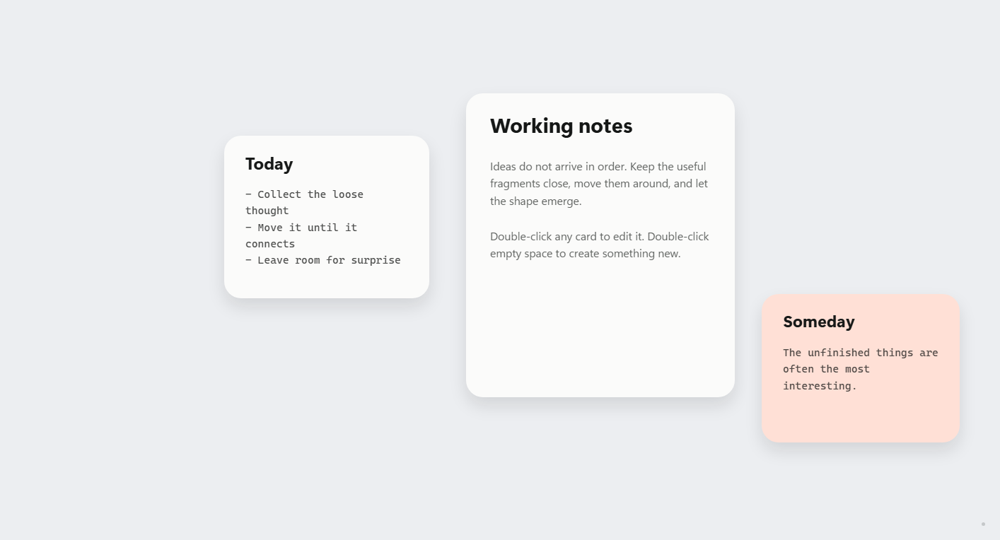

# InspireSpace

> Windows 本地优先的无界灵感画布 MVP。



InspireSpace 根据仓库上层的《Windows Spatial 复刻项目完整交付文档（Vibe Coding AI 直接实现版）》实现，并结合项目根目录中的 5 个参考视频完成了界面与交互重构。产品默认离线运行，不包含账号、遥测、云端接口或自动上传逻辑。

## 设计方向

本版不再使用传统笔记软件的应用框架，而是让内容本身成为界面：

- 无网格、无侧边栏、无详情面板、无常驻顶部操作栏。
- Tauri 无边框窗口；顶部仅保留透明拖动区域，窗口按钮只在右上角悬停时出现。
- 浅灰无界空间、白色软阴影卡片、克制的大圆角与留白。
- 双击空白处才出现临时创建胶囊，操作完成后自动消失。
- 双击卡片在原位置附近直接编辑，不进入大型模态详情页。
- 选中、缩放、保存状态与错误提示均采用最低视觉占用。

## 当前可用能力

- **单无限画布**：鼠标指针中心缩放、右键/空格平移、卡片拖拽和四角缩放。
- **Sticky 便利贴**：5 种柔和纸张颜色、直接编辑、本地自动保存。
- **Sheet Markdown 纸张**：标准裸 `.md` 文件、标题和 Markdown 源文本直接编辑。
- **图片卡片**：从 Windows 文件选择器导入 JPG、PNG、GIF、WebP、BMP、SVG；素材复制到 Vault，数据库只保存路径。
- **上下文创建**：双击空白画布创建 Note、Sheet 或 Image，不占用永久界面空间。
- **本地持久化**：SQLite 保存画布元数据和视口；Rust 原子式写入 Markdown。
- **Windows 桌面壳**：Tauri v2、无边框窗口、系统托盘、托盘恢复/退出。
- **开发预览降级**：直接运行 Vite 时使用 localStorage；正式桌面版使用 Rust、SQLite 和本地文件系统。

## 快捷操作

| 操作 | 方式 |
|---|---|
| 打开临时创建菜单 | 双击空白画布 |
| 快速创建 Note | `N` |
| 快速创建 Sheet | `M` |
| 快速导入图片 | `I` |
| 平移画布 | 右键拖拽，或按住 `Space` 后左键拖拽 |
| 指针中心缩放 | 鼠标滚轮 |
| 缩放快捷键 | `Ctrl +` / `Ctrl -` |
| 框住全部卡片 | `Home` |
| 重置到 100% | `0` |
| 选择 / 移动卡片 | 单击 / 左键拖拽 |
| 调整卡片尺寸 | 选中后拖动四角控制点 |
| 编辑卡片 | 双击卡片 |
| 删除卡片 | `Delete` / `Backspace` |
| 关闭编辑器 | `Esc` 或点击卡片外部 |

## 技术栈

- Tauri v2 / Rust
- React 18 / TypeScript / Vite
- Zustand
- Konva / react-konva
- 定制 CSS
- rusqlite（bundled SQLite）
- Vitest

## 快速启动

### 安装依赖

```powershell
npm install
```

### 浏览器预览

```powershell
npm run dev
```

浏览器预览的数据位于 localStorage，仅用于前端开发。

### Windows 桌面开发模式

```powershell
npm run tauri -- dev
```

### 构建应用

仅生成调试可执行文件：

```powershell
npm run tauri -- build --debug --no-bundle
```

生成 NSIS 安装包：

```powershell
npm run tauri -- build
```

主要产物：

```text
release/InspireSpace_0.1.0_x64-setup.exe
src-tauri/target/debug/inspirespace.exe
src-tauri/target/release/inspirespace.exe
src-tauri/target/release/bundle/nsis/InspireSpace_0.1.0_x64-setup.exe
```

## 默认本地数据结构

首次启动桌面版会初始化：

```text
%USERPROFILE%\Documents\InspireSpace Vault\
├── notes\                       # Sheet 标准 Markdown 文件
├── media\                       # UUID 命名的本地素材副本
├── cache\                       # 缩略图缓存预留目录
└── .inspirespace\
    └── metadata.sqlite3         # 节点、位置、尺寸、视口等元数据
```

数据约束：

- Sheet 正文只写入 `notes/*.md`，不会以私有文本格式锁入数据库。
- 图片不会以 Base64 存入 SQLite/JSON；媒体独立保存，节点只引用文件路径。
- Sticky 作为短灵感保存在 SQLite 元数据中。

## 工程结构

```text
InspireSpace/
├── src/
│   ├── components/canvas/       # 无限画布与三类卡片
│   ├── components/editor/       # 卡片附近的直接编辑器
│   ├── components/shell/        # 极简应用壳与无边框窗口控制
│   ├── lib/backend.ts           # Tauri IPC / 浏览器降级适配器
│   ├── store/useCanvasStore.ts  # Zustand 状态、本地保存和默认构图
│   └── types/canvas.ts          # 共享领域类型
├── src-tauri/
│   ├── src/database.rs          # SQLite 模型与迁移
│   ├── src/workspace.rs         # Vault、Markdown、媒体文件管理
│   ├── src/commands.rs          # Tauri 命令
│   └── src/lib.rs               # 桌面应用、托盘和窗口生命周期
└── docs/                        # 截图与实施计划
```

## 验证命令

```powershell
npm run check
npm test
npm run build
cargo fmt --all -- --check --manifest-path src-tauri/Cargo.toml
cargo check --manifest-path src-tauri/Cargo.toml
npm run tauri -- build --debug --no-bundle
npm run tauri -- build
```

## MVP 边界

本版刻意不提前实现阶段 2–4：多 Vault、Stacks、图层面板、全局 Scratch Pad、全文搜索、标签、网页剪藏、视频/RAW、撤销重做、OneDrive 同步和备份导出。当前代码结构为后续模块保留扩展位置。
