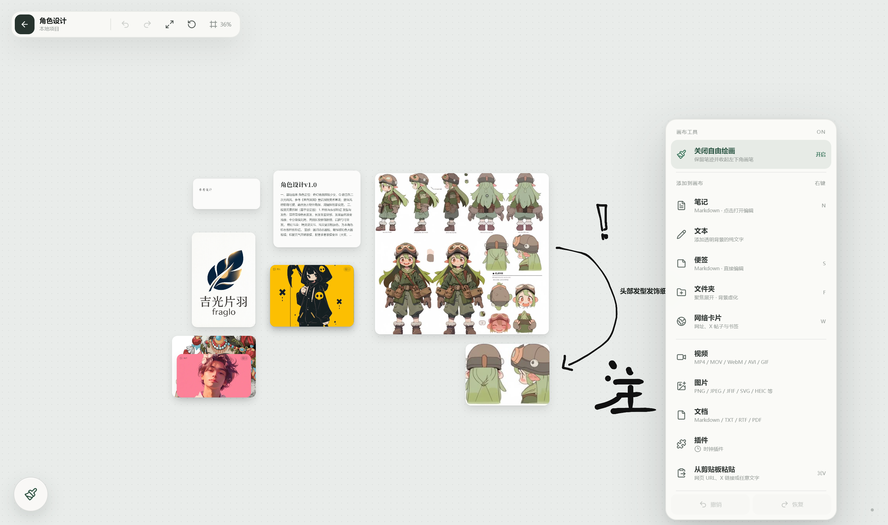

<div align="center">

# ✦ InspireSpace

**把散落的灵感，放回一个属于你的本地无限画布。**

面向 Windows 的本地优先视觉工作台：在同一空间中组织 Markdown 笔记、便签、纯文本、图片、视频、文档、网页、文件夹与插件。

[简体中文](README.md) · [English](README_EN.md)

<p>
  
  
  
  
  
  
  
</p>

[功能概览](#-功能概览) · [立即体验](#-立即体验) · [快捷操作](#-快捷操作) · [开发指南](#-开发指南)

</div>




> [!IMPORTANT]
> InspireSpace 目前处于 **0.1.0 早期版本**，主要面向 Windows 桌面端。核心数据默认保存在本地项目目录中；浏览器模式仅用于前端开发预览。

## 为什么是 InspireSpace？

传统笔记工具要求你先决定“内容应该放在哪”。InspireSpace 更接近真实的思考过程：先把内容放到画布上，再通过位置、大小、堆叠和文件夹逐渐建立关系。

| 本地优先 | 空间化组织 | 多内容共存 | 低干扰交互 |
|---|---|---|---|
| 无账号、无遥测、无自动上传 | 拖拽、缩放、框选、堆叠与聚焦 | 笔记、媒体、网页、文档、插件同屏 | 极简无边框窗口，工具按需出现 |

## ✨ 功能概览

### 项目与工作空间

- **打开 / 新建本地项目**：任意文件夹都可以成为独立灵感空间。
- **最近项目**：欢迎页保留最近打开记录，快速回到工作现场。
- **克隆 Git 仓库**：通过浅克隆创建本地项目，适合围绕代码或资料开展视觉整理。
- **演练空间**：无需准备内容即可体验画布、堆叠、文件夹和缩放操作。

### 无限画布

- 以鼠标指针为中心平滑缩放，支持空格或右键拖动画布。
- 卡片拖拽、四角缩放、单选、多选与框选。
- 自动保存画布节点、布局与视口位置。
- 支持布局操作的撤销 / 恢复，历史上限为 60 步。
- 一键框住全部内容或重置为 100% 视图。

### 丰富的内容对象

- **Markdown 笔记**：正文保存为项目内标准 `.md` 文件。
- **便利贴**：5 种纸张配色，适合短想法和临时提醒。
- **纯文本**：透明背景文字，可直接作为画布标题或标注。
- **图片**：支持 PNG、JPEG/JFIF、SVG、GIF、WebP、TIFF、BMP、ICO、ICNS、HEIC、RAW、EXR、HDR。
- **视频**：支持 MP4、MOV、WebM、AVI，以及 GIF / WebP 动图。
- **文档**：支持 Markdown、TXT、RTF、PDF、Office、CSV、JSON 等常见格式。
- **网络卡片**：粘贴网页、媒体直链或普通文本，自动识别并生成对应对象。
- **插件**：内置本地时钟插件，插件模型为后续扩展预留空间。

### 组织与标注

- **智能堆叠**：把多个对象收纳成堆，也可将对象拖到另一张卡片上快速成堆。
- **堆叠展开与提取**：聚焦查看堆内成员，成员可单独拖出或移入文件夹。
- **文件夹聚焦**：自定义名称、颜色与图标，在聚焦视图中整理子项。
- **图片热点**：在图片任意位置添加标题和说明，并集中编辑或删除热点。
- **自由绘画**：按需启用画笔层，提供笔触、颜色与绘画工具。

### 桌面体验

- Tauri v2 无边框窗口与自定义窗口控制。
- Windows 系统托盘支持隐藏、恢复与退出。
- 拖放本地文件到画布即可批量导入。
- 保存状态与错误提示保持低视觉占用。

## 🚀 立即体验

### 下载 Windows 安装包

仓库内提供当前构建产物：

- [下载 InspireSpace 0.1.0 x64 安装包](release/InspireSpace_0.1.0_x64-setup.exe)
- [查看 SHA-256 校验值](release/SHA256SUMS.txt)

> 安装包为当前仓库版本的早期构建，建议在重要数据之外先行体验。

### 从源码运行

#### 环境要求

- Windows 10 / 11
- Node.js 20 或更高版本
- Rust stable 工具链
- Tauri v2 的 Windows 构建依赖（Microsoft C++ Build Tools 与 WebView2）
- Git（仅“克隆 Git 仓库”功能需要）

#### 安装依赖

```powershell
npm install
```

#### 浏览器开发预览

```powershell
npm run dev
```

浏览器预览会使用 `localStorage` 和浏览器文件能力模拟桌面后端，适合 UI 开发，不代表最终桌面存储行为。

#### Windows 桌面开发模式

```powershell
npm run tauri -- dev
```

#### 构建应用

```powershell
# 仅生成调试可执行文件
npm run tauri -- build --debug --no-bundle

# 生成 Release 可执行文件与 NSIS 安装包
npm run tauri -- build
```

## ⌨️ 快捷操作

| 操作 | 快捷键 / 手势 |
|---|---|
| 打开画布菜单 | 右键空白处 |
| 平移画布 | 右键拖拽，或按住 `Space` 后左键拖拽 |
| 锁定 / 解除手型模式 | 快速轻按 `Space` |
| 指针中心缩放 | 鼠标滚轮 |
| 选择 / 移动对象 | 单击 / 左键拖拽 |
| 多选对象 | `Ctrl` / `Cmd` + 单击，或拖拽框选 |
| 调整对象尺寸 | 选中后拖动四角控制点 |
| 编辑对象 | 双击对象 |
| 新建 Markdown 笔记 | `N` |
| 新建便签 | `S` |
| 新建文件夹 | `F` |
| 新建网络卡片 | `W` |
| 撤销 | `Ctrl + Z` |
| 恢复 | `Ctrl + Y` 或 `Ctrl + Shift + Z` |
| 框住全部内容 | `Home` |
| 重置为 100% | `0` |
| 删除已选对象 | `Delete` / `Backspace` |
| 关闭菜单 / 取消选择 / 收起堆叠 | `Esc` |

## 🔒 本地数据与隐私

桌面版中的每个项目都有独立目录：

```text
Your Project/
├── notes/                       # Markdown 正文
├── media/                       # 导入的图片、视频与文档副本
├── cache/                       # 缓存预留目录
└── .inspirespace/
    └── metadata.sqlite3         # 节点、布局、视口、堆叠与热点元数据
```

数据原则：

- Markdown 正文写入标准文件，不锁定在私有数据库格式中。
- 媒体文件独立保存，SQLite 仅记录引用路径与画布元数据。
- 应用不包含账号、遥测、云端同步或自动上传逻辑。
- 可通过普通文件工具备份、迁移或版本管理整个项目目录。

## 🧱 技术架构

```text
InspireSpace/
├── src/
│   ├── components/canvas/       # 无限画布、对象、堆叠、文件夹、绘画层
│   ├── components/editor/       # 卡片就地编辑器
│   ├── components/shell/        # 欢迎页、项目创建与桌面窗口壳
│   ├── lib/backend.ts           # Tauri IPC 与浏览器降级适配
│   ├── store/useCanvasStore.ts  # Zustand 状态、历史记录与持久化调度
│   └── types/canvas.ts          # 共享领域类型
├── src-tauri/
│   ├── src/commands.rs          # Tauri 命令与 Git 克隆
│   ├── src/database.rs          # SQLite 模型与迁移
│   ├── src/workspace.rs         # 项目、Markdown 与媒体文件管理
│   └── src/lib.rs               # 桌面窗口、托盘和生命周期
├── docs/                        # 截图与设计 / 实施文档
└── release/                     # Windows 安装包与校验文件
```

**核心技术：** Tauri 2 · Rust · React 18 · TypeScript · Vite · Zustand · Konva · GSAP · Drawesome · SQLite · Vitest

## 🛠️ 开发指南

### 常用命令

| 命令 | 用途 |
|---|---|
| `npm run dev` | 启动 Vite 浏览器预览 |
| `npm run check` | 执行 TypeScript 类型检查 |
| `npm test` | 运行 Vitest 测试 |
| `npm run build` | 构建前端生产资源 |
| `npm run tauri -- dev` | 启动桌面开发模式 |
| `npm run tauri -- build` | 构建 Windows 安装包 |

### 完整验证

```powershell
npm run check
npm test
npm run build
cargo fmt --all -- --check --manifest-path src-tauri/Cargo.toml
cargo check --manifest-path src-tauri/Cargo.toml
```

## 🗺️ 项目状态

InspireSpace 仍处于快速迭代阶段。当前版本已经覆盖项目管理、无限画布、多类型对象、堆叠、文件夹、热点、绘画与本地持久化等核心体验；后续将继续完善搜索、标签、备份导出、更多插件、更完整的媒体能力与跨设备工作流。

如果你发现问题或有功能建议，欢迎通过 [GitHub Issues](https://github.com/SmiLeXio/InspireSpace/issues) 参与讨论。

---

<div align="center">

**InspireSpace — Think spatially. Keep it locally.**

[返回顶部](#-inspirespace) · [English README](README_EN.md)

</div>
