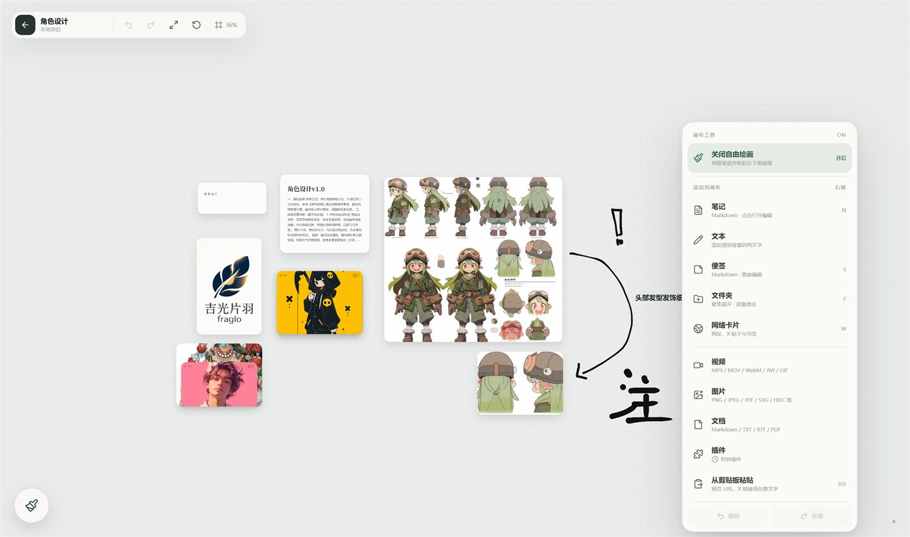

<div align="center">

# ✦ InspireSpace

**Bring scattered ideas back to an infinite canvas you truly own.**

A local-first visual workspace for Windows where Markdown notes, sticky notes, text, images, videos, documents, web cards, folders, and plugins can live together.

[简体中文](README.md) · [English](README_EN.md)

<p>
  
  
  
  
  
  
  
</p>

[Highlights](#-highlights) · [Get Started](#-get-started) · [Shortcuts](#-shortcuts) · [Development](#-development)

</div>

[](docs/首屏.png)

[](docs/内部页面.png)

> [!IMPORTANT]
> InspireSpace is currently an **early 0.1.0 release** focused on Windows desktop. Core data is stored in local project folders by default. Browser mode is intended for frontend development and preview only.

## Why InspireSpace?

Traditional note-taking tools ask you to decide where something belongs before you can capture it. InspireSpace follows a more natural process: put ideas on the canvas first, then shape their relationships through position, size, stacks, and folders.

| Local-first | Spatial organization | Mixed content | Low-distraction UI |
|---|---|---|---|
| No account, telemetry, or automatic upload | Drag, zoom, select, stack, and focus | Notes, media, web content, documents, and plugins | Minimal frameless window with tools shown only when needed |

## ✨ Highlights

### Projects and workspaces

- **Open or create local projects**: any folder can become an independent inspiration space.
- **Recent projects**: quickly return to recently opened workspaces from the welcome screen.
- **Clone Git repositories**: create a project from a shallow clone, useful for visually organizing code and research materials.
- **Demo workspace**: explore canvas navigation, stacks, folders, and zooming without preparing content first.

### Infinite canvas

- Smooth pointer-centered zooming with Space-drag or right-drag panning.
- Dragging, corner resizing, single selection, multi-selection, and marquee selection.
- Automatic persistence for nodes, layouts, and viewport position.
- Undo and redo for layout operations, with up to 60 history entries.
- Fit all content into view or reset instantly to 100% zoom.

### Rich canvas objects

- **Markdown notes**: content is saved as standard `.md` files inside the project.
- **Sticky notes**: five paper colors for quick thoughts and temporary reminders.
- **Plain text**: transparent text objects for headings and lightweight annotations.
- **Images**: PNG, JPEG/JFIF, SVG, GIF, WebP, TIFF, BMP, ICO, ICNS, HEIC, RAW, EXR, and HDR.
- **Videos**: MP4, MOV, WebM, AVI, plus animated GIF and WebP.
- **Documents**: Markdown, TXT, RTF, PDF, Office files, CSV, JSON, and more.
- **Web cards**: paste a webpage, media URL, or plain text and let InspireSpace create the appropriate object.
- **Plugins**: includes a local clock plugin and a plugin-ready canvas object model.

### Organization and annotation

- **Smart stacks**: stack multiple selected objects or drag one object onto another to create a stack.
- **Expand and extract**: focus on stack members, then drag individual items out or move them into folders.
- **Focused folders**: customize names, colors, and icons, then organize child items in a dedicated focus view.
- **Image hotspots**: attach titles and descriptions to any point in an image, with centralized editing and removal.
- **Freehand drawing**: enable an on-demand drawing layer with brush, stroke, and color controls.

### Desktop experience

- Frameless Tauri v2 window with custom window controls.
- Windows system tray actions for hiding, restoring, and quitting the app.
- Batch import by dragging local files directly onto the canvas.
- Quiet save-state and error feedback that stays out of the way.

## 🚀 Get Started

### Download the Windows installer

The current build is included in this repository:

- [Download InspireSpace 0.1.0 x64](release/InspireSpace_0.1.0_x64-setup.exe)
- [View the SHA-256 checksum](release/SHA256SUMS.txt)

> This installer is an early build of the current repository. Try it with non-critical data first.

### Run from source

#### Prerequisites

- Windows 10 or 11
- Node.js 20 or later
- Rust stable toolchain
- Windows build prerequisites for Tauri v2, including Microsoft C++ Build Tools and WebView2
- Git, only if you want to use the repository cloning feature

#### Install dependencies

```powershell
npm install
```

#### Browser development preview

```powershell
npm run dev
```

The browser preview uses `localStorage` and browser file APIs to emulate the desktop backend. It is useful for UI development, but it does not represent the final desktop storage behavior.

#### Windows desktop development

```powershell
npm run tauri -- dev
```

#### Build the application

```powershell
# Build a debug executable without a bundle
npm run tauri -- build --debug --no-bundle

# Build release executables and the NSIS installer
npm run tauri -- build
```

## ⌨️ Shortcuts

| Action | Shortcut / gesture |
|---|---|
| Open the canvas menu | Right-click an empty area |
| Pan the canvas | Right-drag, or hold `Space` and left-drag |
| Lock / unlock hand mode | Quickly tap `Space` |
| Zoom around the pointer | Mouse wheel |
| Select / move an object | Click / left-drag |
| Select multiple objects | `Ctrl` / `Cmd` + click, or marquee-select |
| Resize an object | Drag a corner handle after selecting it |
| Edit an object | Double-click the object |
| Create a Markdown note | `N` |
| Create a sticky note | `S` |
| Create a folder | `F` |
| Create a web card | `W` |
| Undo | `Ctrl + Z` |
| Redo | `Ctrl + Y` or `Ctrl + Shift + Z` |
| Fit all content | `Home` |
| Reset to 100% | `0` |
| Delete selected objects | `Delete` / `Backspace` |
| Close menus / clear selection / collapse a stack | `Esc` |

## 🔒 Local Data and Privacy

Each desktop project owns its own directory:

```text
Your Project/
├── notes/                       # Markdown content
├── media/                       # Imported image, video, and document copies
├── cache/                       # Reserved cache directory
└── .inspirespace/
    └── metadata.sqlite3         # Node, layout, viewport, stack, and hotspot metadata
```

Data principles:

- Markdown content is written to standard files instead of being locked inside a proprietary database format.
- Media is stored as separate files; SQLite records only references and canvas metadata.
- The application contains no account system, telemetry, cloud sync, or automatic upload logic.
- A complete project can be backed up, moved, or version-controlled with ordinary file tools.

## 🧱 Architecture

```text
InspireSpace/
├── src/
│   ├── components/canvas/       # Infinite canvas, objects, stacks, folders, drawing layer
│   ├── components/editor/       # In-place card editor
│   ├── components/shell/        # Welcome screen, project creation, desktop shell
│   ├── lib/backend.ts           # Tauri IPC and browser fallback adapter
│   ├── store/useCanvasStore.ts  # Zustand state, history, persistence scheduling
│   └── types/canvas.ts          # Shared domain types
├── src-tauri/
│   ├── src/commands.rs          # Tauri commands and Git cloning
│   ├── src/database.rs          # SQLite models and migrations
│   ├── src/workspace.rs         # Projects, Markdown, and media management
│   └── src/lib.rs               # Desktop window, tray, and lifecycle
├── docs/                        # Screenshots and design / implementation notes
└── release/                     # Windows installer and checksum
```

**Core stack:** Tauri 2 · Rust · React 18 · TypeScript · Vite · Zustand · Konva · GSAP · Drawesome · SQLite · Vitest

## 🛠️ Development

### Common commands

| Command | Purpose |
|---|---|
| `npm run dev` | Start the Vite browser preview |
| `npm run check` | Run TypeScript type checking |
| `npm test` | Run the Vitest test suite |
| `npm run build` | Build production frontend assets |
| `npm run tauri -- dev` | Start desktop development mode |
| `npm run tauri -- build` | Build the Windows installer |

### Full verification

```powershell
npm run check
npm test
npm run build
cargo fmt --all -- --check --manifest-path src-tauri/Cargo.toml
cargo check --manifest-path src-tauri/Cargo.toml
```

## 🗺️ Project Status

InspireSpace is evolving rapidly. The current release already covers project management, an infinite canvas, mixed object types, stacks, folders, hotspots, drawing, and local persistence. Future work will continue to improve search, tagging, backup and export, additional plugins, deeper media support, and cross-device workflows.

Found a bug or have an idea? Join the discussion through [GitHub Issues](https://github.com/SmiLeXio/InspireSpace/issues).

---

<div align="center">

**InspireSpace — Think spatially. Keep it locally.**

[Back to top](#-inspirespace) · [简体中文](README.md)

</div>
